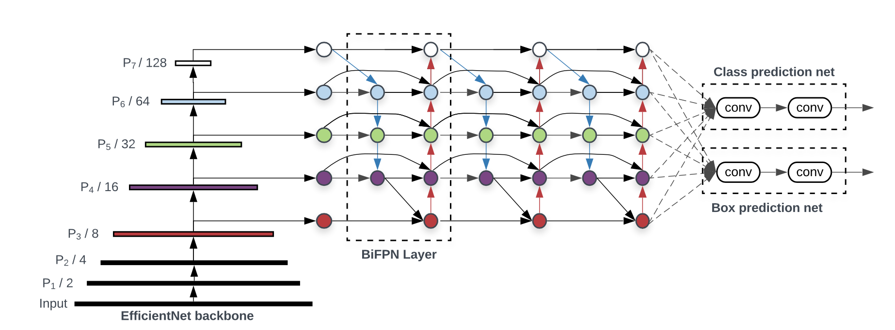
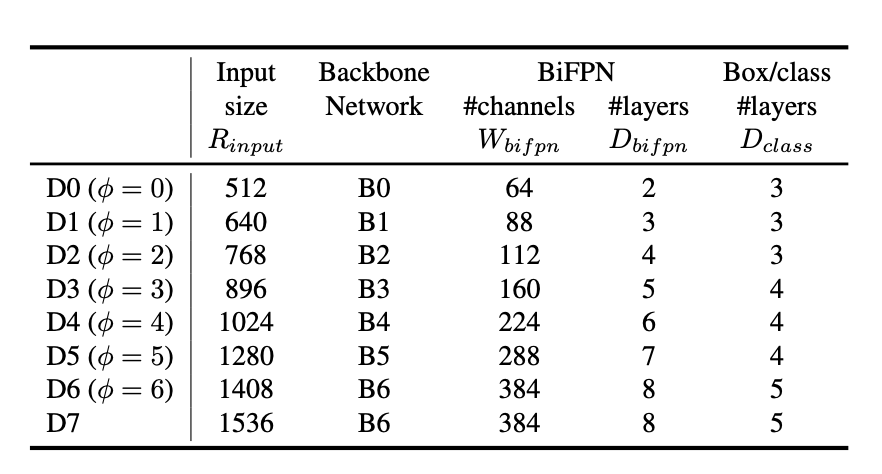
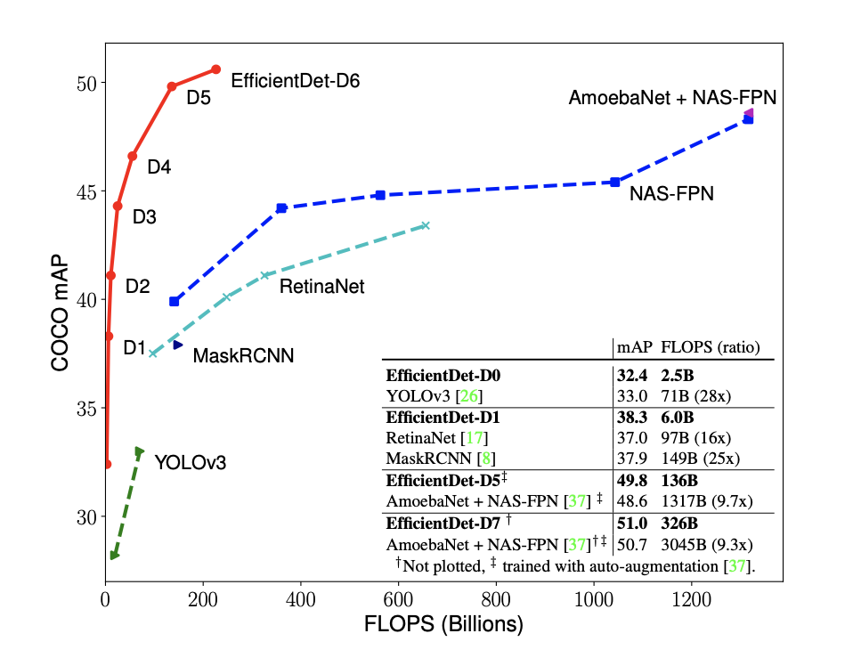

# EfficientDet-PyTorch
A PyTorch implementation of EfficientDet

# Overview
A PyTorch implementation of EfficientDet architecture: [EfficientDet: Scalable and Efficient Object Detection](https://arxiv.org/pdf/1911.09070.pdf).
Based on EfficientNet, newly introduce a weighted bi-directional feature pyramid network (BiFPN) and propose a compound scaling method that uniformly scales the resolution, depth, and width for all backbone, feature network, and box/class prediction networks at the same time. EfficientDet-D6 achieves state-of-the-art 50.9 mAP on COCO dataset with 52M parameters and 229B FLOPs, being 4x smaller and using 13x fewer FLOPs yet still more accurate (+0.2% mAP) than the best previous detector.

# EfficientDet Architecture

# EfficientDet Results

# Disclaimer
Backbone model EfficientNet is modified from my own implementation of [EfficientNet-PyTorch](https://github.com/romulus0914/EfficientNet-PyTorch). EfficientDet is based on the official implementation [google/automl/efficientdet](https://github.com/google/automl/tree/master/efficientdet) in Tensorflow.
